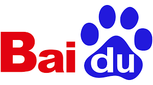

We introduced LLM to realize the human-robot interaction system with autonomous underwater vehicles (AUV)



# Contribution
Our work is to establish a ROS2-based AUV interactive system. By leveraging LLM's understanding of human instructions, we provide high-level decisions to the low-level controllers, thereby reducing the complexity of sea trials.
* High Level Control Decision Making - from LLM
* Low level controller - from NMPC
# Prerequisites
* Install [ROS2 Humble](https://docs.ros.org/en/humble/)
* Ubuntu 22.04
* Install [Ignition Gazebo](https://gazebosim.org/docs/garden/ros_installation/)

# LLM in ROS2 （High Level）
The combination of LLM and ROS2 aims to utilize the LLM's ability to understand natural language commands in conjunction with ROS2's robotics framework to provide an efficient and flexible control system.
## How to use
* colcon packages
```python
colcon build --packages-select bluerov_llm
```
* Loading Environment Variables for a Specific Workspace or ROS2 Installation
```python
source install/setup.bash
source /opt/ros/humble/setup.bash
```
* case1: Speed Setting Instruction
The current speed of the AUV can be obtained by self-perception in ROS2
```python
ros2 run bluerov_llm chat "Move the bluerov2 faster 0.2m/s".
```
* case2: Navigation instruction
```python
ros2 run bluerov_llm chat "Change the MPC weight matrix to [20,20,20,0.1,0.1,0.1]."
ros2 run bluerov_llm chat "Based on the previous instruction, Increase the NMPC weight matrix, first state to 30."
```
* case3: Trajectory Generation Instructions
```python
ros2 run bluerov_llm chat "Set the trajectory with the speeds along the X and Z axes set to 0.7 m/s and 0.1 m/s respectively, while the Y-coordinate follows a sine wave with a period of 20 seconds and an amplitude of 5 meters."
```
or it means expressing instructions in a more human-like manner.
```python
ros2 run bluerov_llm chat "I want the system to follow a path with a surge speed of 1.0 m/s, a sway speed of 0.5 m/s, a Y-axis maximum of 10 meters, and a sinusoidal period of 15 seconds."
```
# NMPC Controller (Low Level )
The simulation model we developed is based on bluerov2, utilizing the NMPC algorithm as the underlying controller.
The execution of this NMPC controller relies on the simulation platform on which we designed Bluerov2.
## Prerequisites
* Install [acados](https://docs.acados.org/)
* Install [Bluerov2_sim]
## How to use

* Follow the steps in [Bluerov2_sim] to start the Gazebo simulation platform.
* The algorithms in this section can be tested by creating a conda environment.
```python
conda create --name bluerov2_nmpc
conda activate bluerov2_nmpc
```
* Switch paths ```cd Bleurov_nmpc ```
* Direct execution of the current file  ```python main.py```
## Debugging
* If there is a problem with acados path setting in the run, you can type.
```python
export ACADOS_SOURCE_DIR="your_path/acados"
```
# Getting Help
If you have any questions about using or contributing to this program, please ask on our discussion board!

## License
This project is issued under the MIT license.


